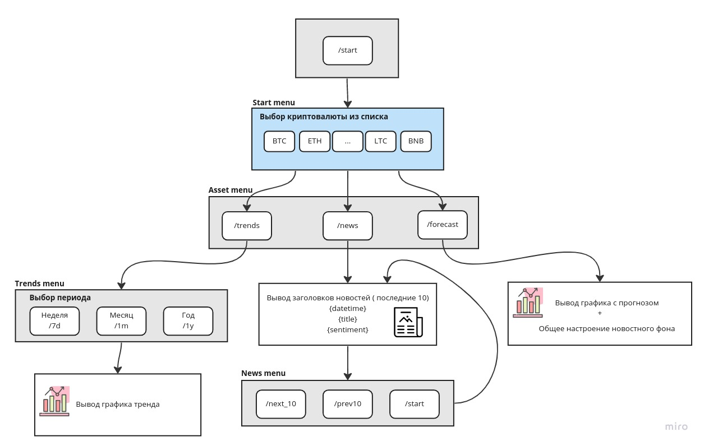

# Система прогнозирования и анализа курса криптовалют

[ML System Design Course Automn 22](https://ods.ai/tracks/ml-system-design-22)

Набор программных средств для прогнозирования и анализа курса криптовалют.

* **Botton** - телеграмм-бот для анализа и прогнозирования курса криптовалют
* **MainAnalyser** - служебное приложение с оконным интерфейсом 
* **NewsParser** - приложение-робот для мониторинга новостного фона
* **NewsDB** - сервис для работы с БД новостей криптовалютного рынка

## Структура частей системы

<center>

</center>


## Меню телеграмм-бота **Botton**
Пользовательский интерфейс

<center>

</center>

## Установка на Linux

Установить Python версии 3.10 (см. [инструкцию](https://cloudbytes.dev/snippets/upgrade-python-to-latest-version-on-ubuntu-linux))

Создать виртуальное окружение

``` bash
python3 -m venv .venv
```

Активизировать виртуальное окружение

``` bash
source .venv/bin/activate
```

Установить зависимости

``` bash
python3 -m pip install -r requirements.txt
```

или (для минимального количества зависимостей):

``` bash
python3 -m pip install -r req_needed.txt
```

## Запуск

``` bash
python3 main.py
```
